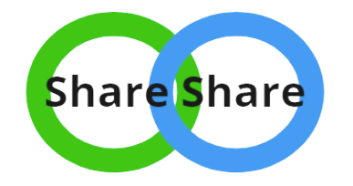

# Share Share eCommerce Application


## About this platform
Share Share is a product sharing platform that ensures sustainability by facilitating bulk purcase among customers. In particular, this platform will help solve consumers' problems in these context:
* Online shopping with minimum order quantity and/or amount in order to enjoy free delivery fees
* Food delivery services that either charges a high "small order fee" or has minimum order amount to fulfil
* Excessive amount of leftovers due to the big portions sold at supermarket
* Person to share 1-for-1 deals or other promotions with

This platform facilitates 3 main user scenarios:
* User creates an account
* User makes a listing
* User places an order

## Steps to run the solution


```bash
1. Create a MySQL database user called is213 (just like the labs)
2. Run create_db.sql file using Workbench
3. Place the the folder "frontend_codes" in the WAMP web root
4. Navigate to the folder "projdocker" using CMD and enter "docker-compose up -d"
5. Access the app using your browser, by entering the route you have place the folder frontend_codes in

```

## Author
🙋‍♀️ Wei Ping<br />
✉️ weiping.tan.2020@scis.smu.edu.sg <br />
🇮🇳 https://www.linkedin.com/in/tan-wei-ping-81013118b/ <br />
Git [@weiping](https://github.com/tanweiping) <br />
